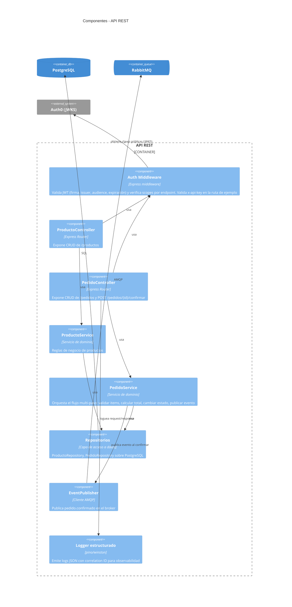

# C4 - Nivel 3: Component

Vista interna del contenedor **API REST** (el contenedor más relevante para el TPI).

## Flujo multi-paso destacado (confirmar pedido)

1. `PedidoController` recibe `POST /pedidos/{id}/confirmar` con Bearer JWT (`scope: confirm:pedidos`).
2. `authMw` valida token y scope.
3. `PedidoService.confirmar(id)`:
   - Verifica que el pedido exista y no esté ya confirmado.
   - Valida que cada producto referenciado exista y esté disponible.
   - Calcula el total sumando `cantidad * precioUnitario`.
   - Cambia el estado del pedido a `confirmado`.
   - Persiste los cambios vía `PedidoRepository`.
   - Publica el evento `pedido.confirmado` vía `EventPublisher`.
4. El Worker de Cocina (fuera de este contenedor) consume el evento y genera la `OrdenCocina`.
