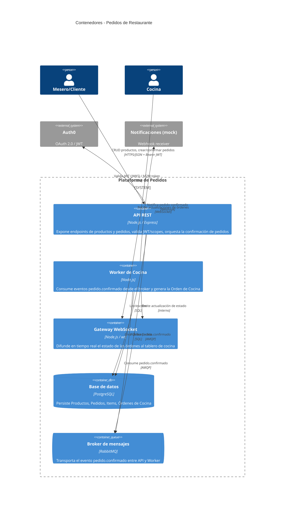

# C4 - Nivel 2: Container

Vista de los "contenedores" (servicios desplegables) que componen la plataforma.

## Notas

- El "Worker de Cocina" y el "Gateway WebSocket" pueden vivir en el mismo proceso al principio (simplificación válida para el TPI); igual conviene dibujarlos separados porque son responsabilidades distintas.
- El endpoint protegido con `x-api-key` (requisito de la consigna) vive dentro del mismo contenedor API, como una ruta aparte de ejemplo — no hace falta un contenedor nuevo.
