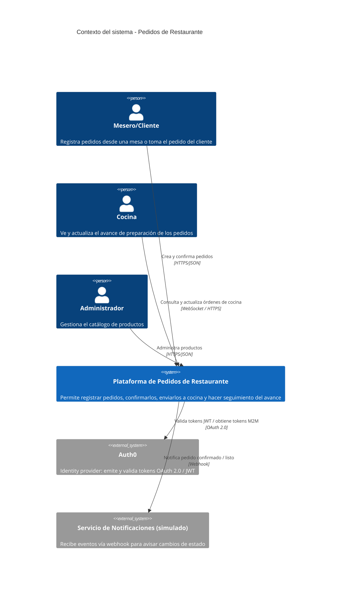

# C4 - Nivel 1: Context

Vista de alto nivel: quién usa el sistema y con qué sistemas externos interactúa.

## Notas

- El "sistema" es una caja única desde este nivel: todavía no importa si es un monolito o varios servicios.
- Auth0 es el Authorization Server externo (client_credentials para clientes M2M, validación de JWT en la API).
- El servicio de notificaciones puede ser un mock simple (otro endpoint que loguea el webhook recibido) — no hace falta un proveedor real.
