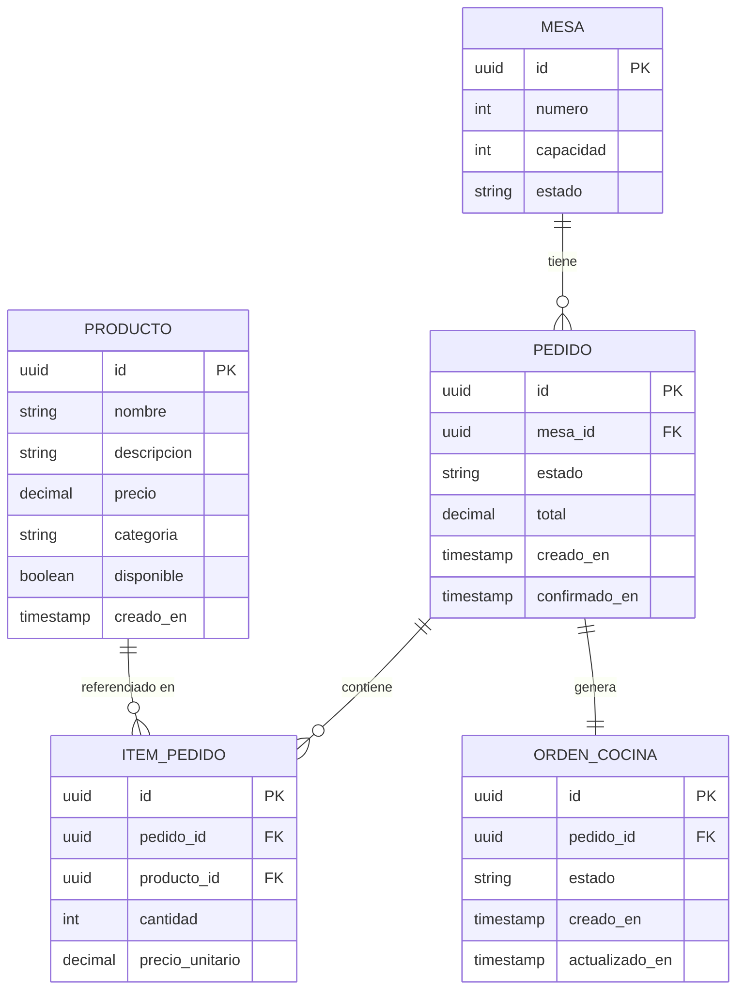

# Modelo de datos

Motor: **PostgreSQL** (ver ADR 002).

## Estados

**Pedido:** `pendiente` -> `confirmado` -> `en_preparacion` -> `listo` -> `entregado` (o `cancelado` desde `pendiente`/`confirmado`).

**OrdenCocina:** `recibida` -> `en_preparacion` -> `lista`.

## Reglas de validación relevantes

- Un pedido no puede confirmarse sin al menos un ítem (`pedido sin ítems`).
- Un pedido ya `confirmado` no puede volver a confirmarse (`pedido ya confirmado`).
- Cada `producto_id` referenciado en un ítem debe existir y estar `disponible` (`producto inexistente`).
- Transiciones de estado fuera de la máquina de estados definida arriba se rechazan (`estado inválido`).

## Migraciones y seed

- Se recomienda una herramienta de migraciones versionadas (Prisma, Knex o TypeORM) sobre escribir SQL a mano.
- El seed inicial debe cargar: 3-5 productos de ejemplo, 2-3 mesas, y opcionalmente un pedido ya confirmado para poder mostrar el flujo de consulta sin tener que crear todo en la demo.
